## 下载 Office Tool Plus

官方下载链接：https://otp.landian.vip/zh-cn/download.html

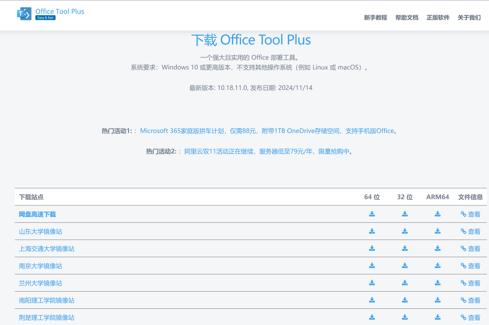

一般下载*64 位*即可。建议直接用上海交通大学镜像站的链接，是自带 runtime 的版本。

## 通过 Office Tool Plus 下载 Office

下载好了之后解压，双击打开 `Office Tool Plus.exe`。

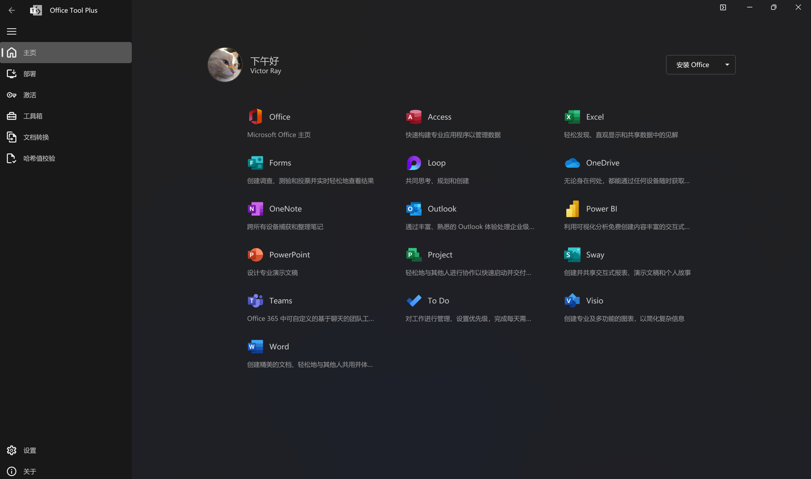

点击“安装 Office”进入“部署”页。确保“部署模式”是“下载”。

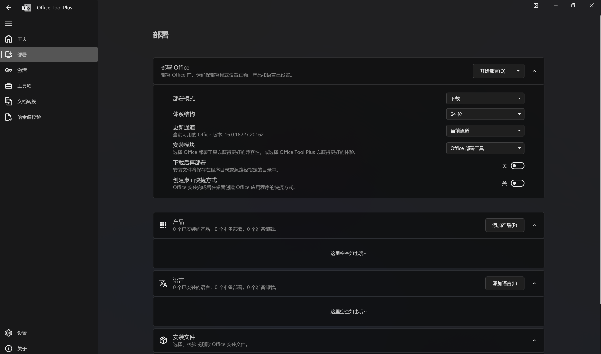

点击“添加产品”，在窗口选择你需要的 Office 版本，然后点击“确定”。建议使用 `Office LTSC 专业增强版 2024 - 批量许可证`，搜索框输入 `2024Volume` 即可找到。

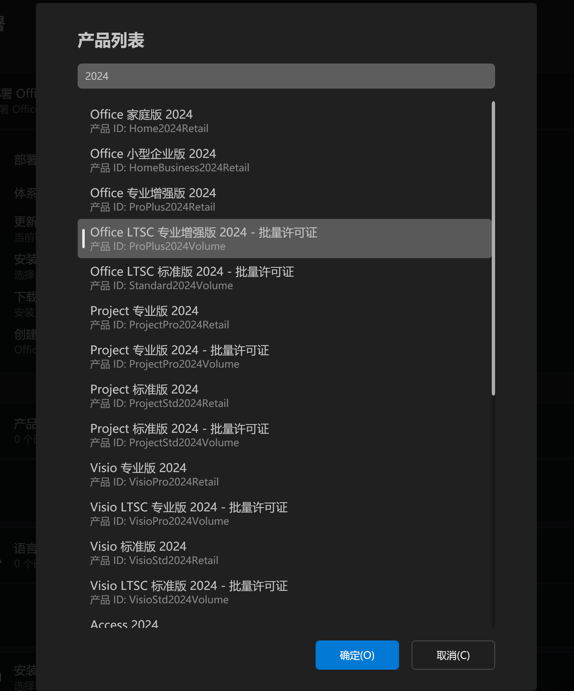

点击“添加产品”，在窗口的搜索框输入 zh-cn 选择 `简体中文（中国）`，然后点击“确定”。

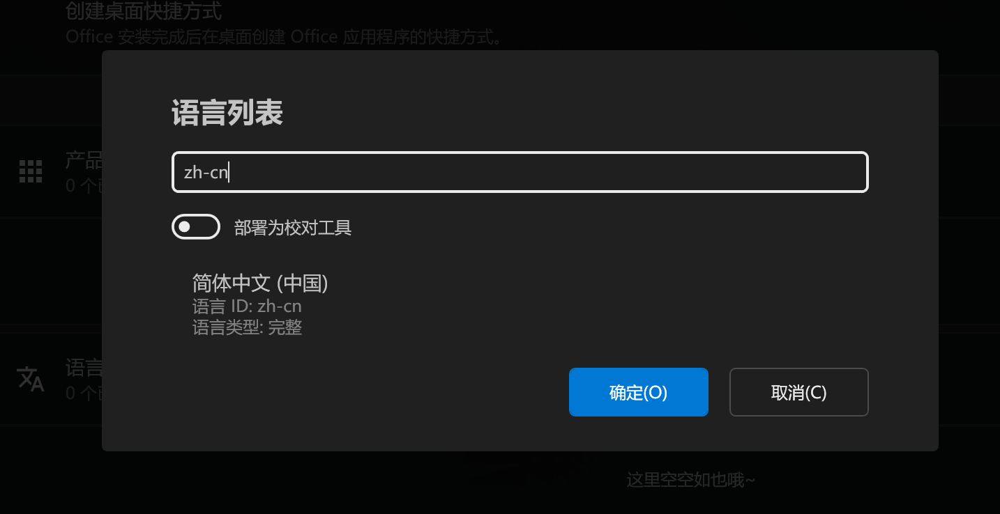

现在回到“部署”页，点击“开始部署”，耐心等待下载好即可。

***如果使用 LTSC 版，注意设置对应的更新通道（如 LTSC 2024 就选 Office 2024 企业长期版）！***

下载完毕之后把“部署模式”改成“安装”。选择需要安装的“应用程序”（这里我选了 Access、Word、Excel、PowerPoint）然后点击“开始部署”。

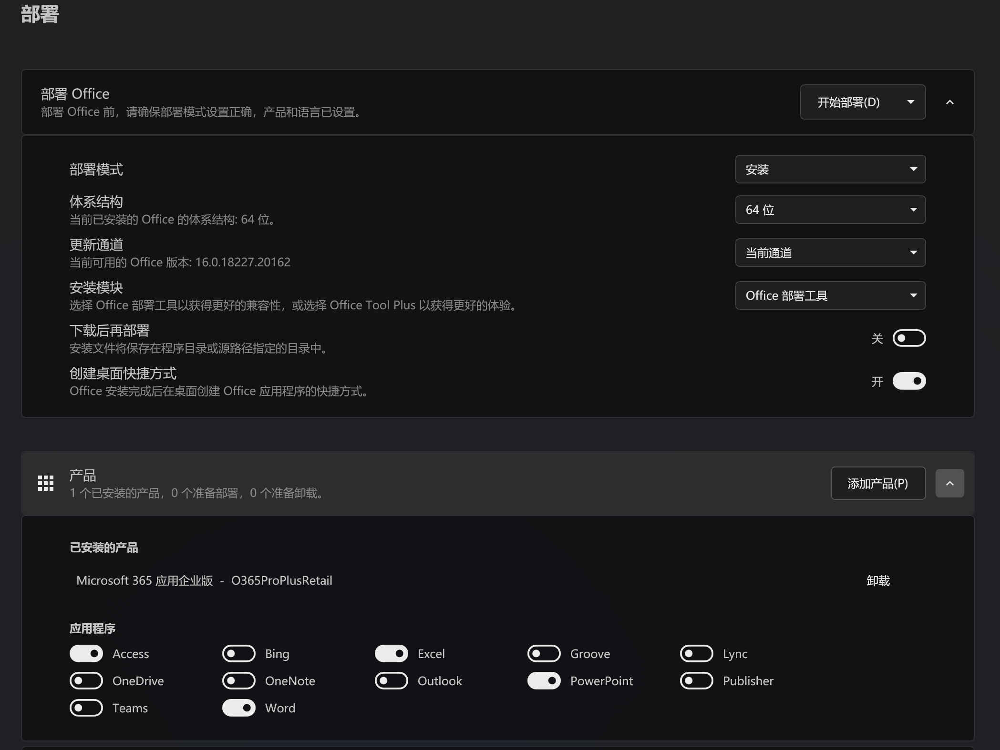

出现这样的界面，点击“是”，安装就开始了。

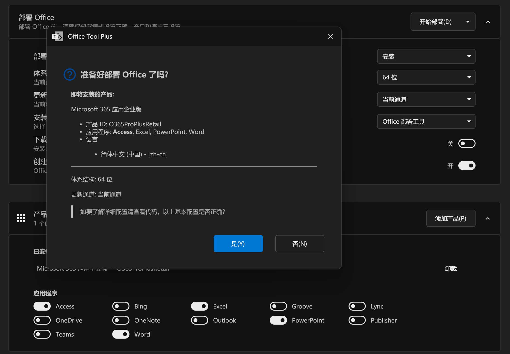

> 因为我有 Microsoft 365 Developer Subscription，也就是俗称的 E5 订阅，所以我选的是 Microsoft 365 应用企业版。注意根据自己的实际情况来选择。

## 通过 Office Tool Plus 激活 Office

安装完成之后转到“激活”页。

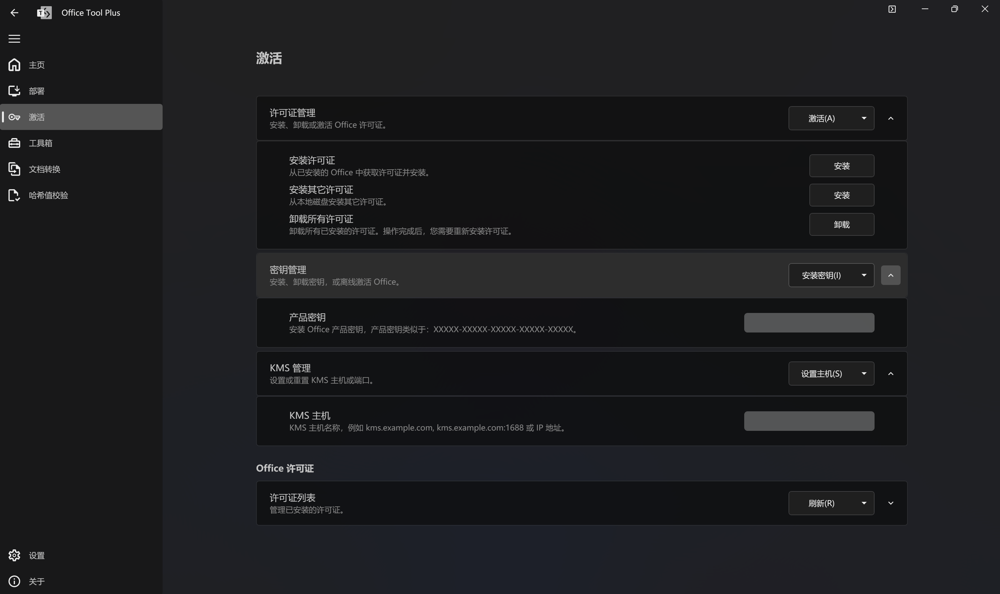

先点“卸载所有许可证”右侧的“卸载”，然后点“安装许可证”右侧的“安装”，搜索框输入 `2024Volume` 即可找到 `Office LTSC 专业增强版 2024 - 批量许可证`，选择并“确定”。

关键步骤来了：填写 KMS 服务器。

从 [这里](https://www.coolhub.top/tech-articles/kms_list.html) 找一个 KMS 服务器填进“KMS 主机”右侧的框里去，然后点击上面的“设置主机”。我这里用的是 `kms.loli.beer`。

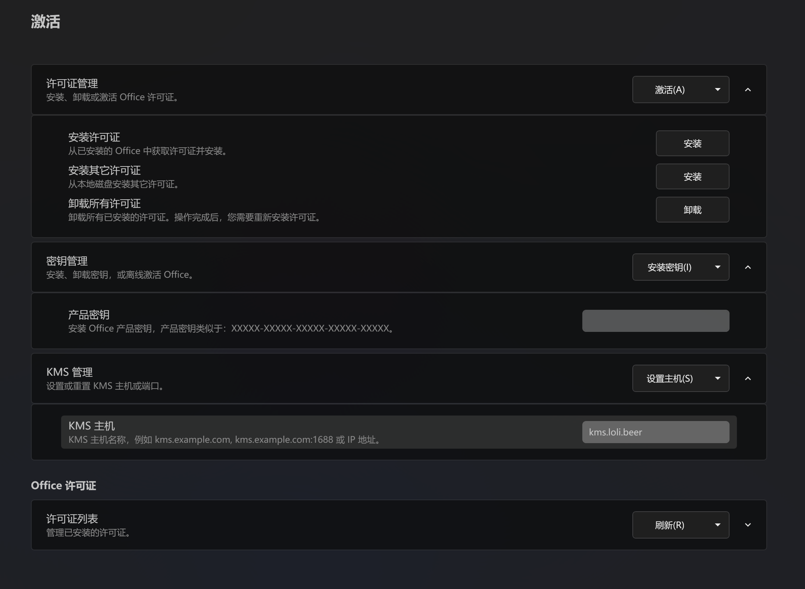

划到下面的“许可证列表”，点右侧的“展开”和“刷新”，应该会出现一个以 Office 24 开头的许可证。然后展开，点击下面的“激活”。

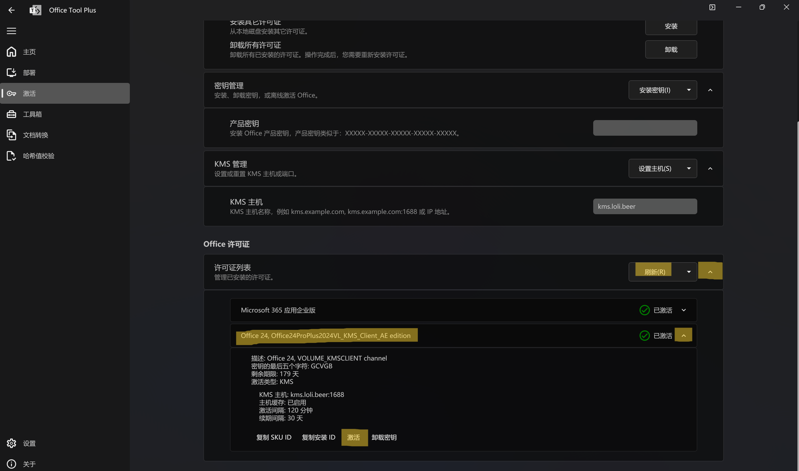

恭喜你，如果出现这个界面，那就是激活成功了，enjoy!

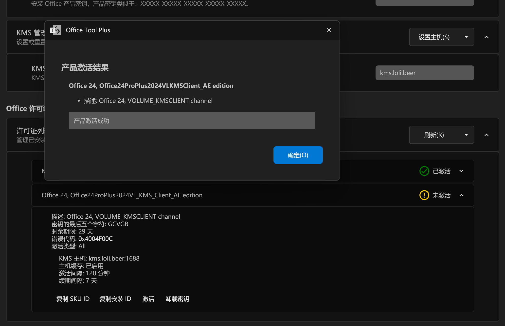
